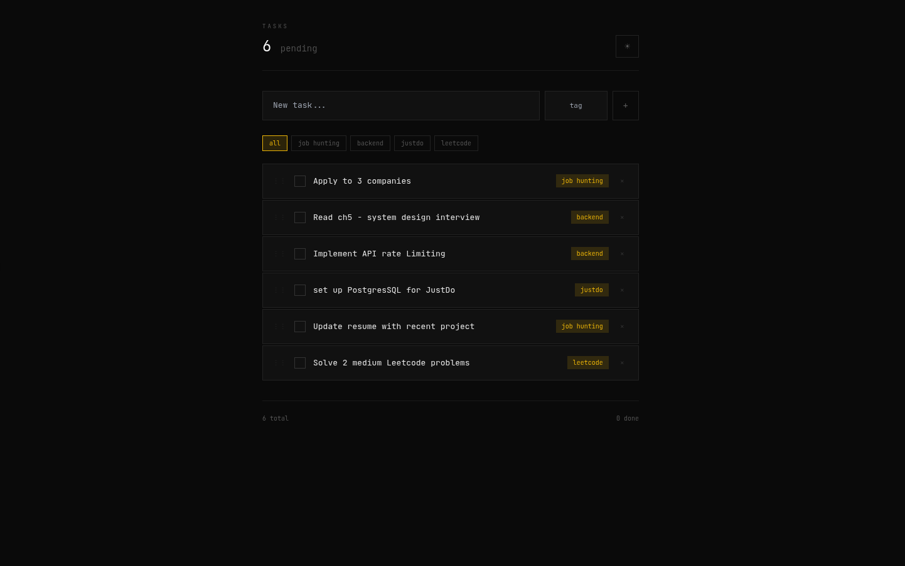

# JustDo

A minimal, elegant todo app with drag-and-drop reordering and tags.



## Features

- ✓ Clean, minimal UI (dark/light mode)
- ✓ Drag-and-drop reordering
- ✓ Tag-based organization
- ✓ Filter by tags
- ✓ User authentication
- ✓ Mobile responsive

## Tech Stack

- **Backend:** Django + Django REST Framework + JWT
- **Frontend:** React + Vite
- **Database:** SQLite (dev) / PostgreSQL (prod)

## Setup

### Prerequisites

- Python 3.10+
- Node.js 18+
- npm

### Backend
```bash
cd backend

# Create and activate virtual environment
python3 -m venv .venv
source .venv/bin/activate

# Install dependencies
pip install -r requirements.txt

# Create environment file
cp .env.example .env

# Run migrations
python manage.py migrate

# Create admin user (optional)
python manage.py createsuperuser

# Start server
python manage.py runserver
```

### Frontend
```bash
cd frontend

# Install dependencies
npm install

# Create environment file
cp .env.example .env

# Start dev server
npm run dev
```

Open `http://localhost:5173` in your browser.

## API Endpoints

| Method | Endpoint | Description |
|--------|----------|-------------|
| POST | `/api/auth/register/` | Create account |
| POST | `/api/auth/login/` | Get JWT tokens |
| POST | `/api/auth/refresh/` | Refresh access token |
| GET | `/api/auth/me/` | Get current user |
| GET | `/api/tasks/` | List tasks |
| POST | `/api/tasks/` | Create task |
| PATCH | `/api/tasks/:id/` | Update task |
| DELETE | `/api/tasks/:id/` | Delete task |
| POST | `/api/tasks/reorder/` | Reorder tasks |

## Project Structure
```
justdo/
├── backend/
│   ├── config/          # Django settings
│   ├── apps/
│   │   ├── users/       # Authentication
│   │   └── tasks/       # Task CRUD
│   ├── core/            # Shared utilities
│   └── requirements.txt
│
├── frontend/
│   ├── src/
│   │   ├── api/         # API client
│   │   ├── context/     # Auth context
│   │   ├── hooks/       # Custom hooks
│   │   ├── pages/       # Page components
│   │   └── styles/      # Global styles
│   └── package.json
│
└── README.md
```

## Environment Variables

### Backend (.env)
```
DEBUG=True
SECRET_KEY=your-secret-key
ALLOWED_HOSTS=localhost,127.0.0.1
CORS_ALLOWED_ORIGINS=http://localhost:5173
```

### Frontend (.env)
```
VITE_API_URL=http://localhost:8000/api
```

## License

MIT